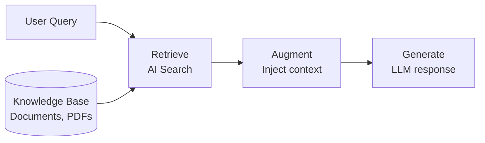
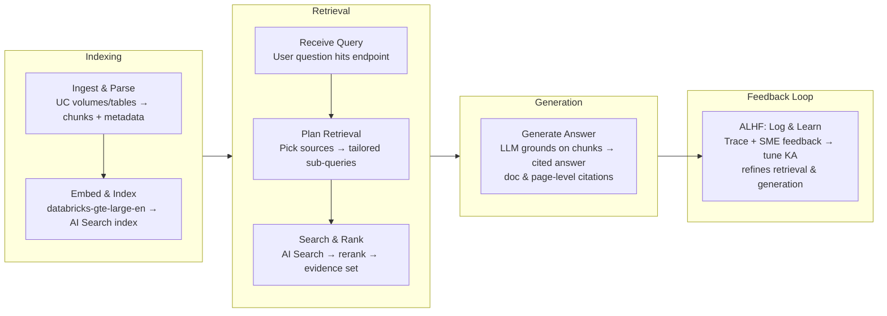

# Lecture - Agent Bricks for Retrieval and Context Engineering

> Source: [Databricks Partner Academy – Building RAG Agents with Agent Bricks](https://partner-academy.databricks.com/learn/learning-plans/315/generative-ai-engineering-pathway/courses/5857/building-rag-agents-with-agent-bricks/lessons/64405:3570/agent-bricks-for-retrieval-and-context-engineering)

## Overview

This lecture introduces the core ideas behind retrieval agents and context engineering on Databricks. We'll cover why prompting alone isn't enough, how Retrieval Augmented Generation (RAG) fills the gap, what context engineering means for agent systems, and how Databricks Knowledge Assistants offer a managed path to production-grade RAG.

## Learning Objectives

By the end of this lecture, you will be able to:

- Explain what retrieval agents are and why they are needed
- Define context engineering and distinguish it from prompt engineering
- Describe Databricks Knowledge Assistants as a managed retrieval agent solution
- Identify the key components of a Knowledge Assistant

---

## A. Introduction to Retrieval Agents

### A1. Why Retrieval Agents?

Large Language Models (LLMs) are powerful, but they have hard limits. No amount of prompt refinement can overcome:

- **Knowledge cutoffs** - the model doesn't know about events after its training date
- **Hallucination** - the model fabricates plausible-sounding facts when it lacks real data
- **Missing private context** - the model has no access to your organization's proprietary documents

Retrieval Augmented Generation (RAG) addresses these limits by injecting relevant external data into the model's context at query time. Instead of relying on frozen training data, a RAG system retrieves relevant documents, augments the prompt with them, and lets the model generate a grounded response.

A **retrieval agent** is a concrete implementation of this pattern that handles query routing, retrieval orchestration, and context assembly within a real system.



> **Learn More**
> See the Databricks documentation on Retrieval Augmented Generation (AWS | Azure | GCP) for a deeper dive.

---

## B. Introduction to Context Engineering

### B1. From Prompt Engineering to Context Engineering

**Prompt engineering** focuses on crafting the instruction text sent to a model. It involves choosing the right words, formatting, and examples. It's tactical and operates at the level of a single query.

**Context engineering** is a broader discipline. It's the art and science of designing the entire information environment that a model receives: not just the question, but all the supporting data, instructions, history, and constraints that shape the model's decision at inference time.

Think of it this way: prompt engineering is writing a good question on an exam. Context engineering is designing the entire exam room, including the reference materials on the desk, the instructions on the board, and the rules about what resources are allowed.

| Prompt Engineering | Context Engineering |
|---|---|
| **Context window: the instruction text** | **Context window: the entire input environment** |
| System instructions | System instructions |
| Few-shot examples | Retrieved documents + metadata |
| User prompt | Conversation history + user constraints (Lakebase) |
| | Tool usage (MCP + Genie) |
| | User prompt |

Moving from prompt engineering to context engineering means better management for the entire context state.

### B2. Why Context Engineering Matters for Agents

When building AI agents (systems that reason, plan, and take actions), context engineering becomes essential. An agent doesn't just answer one question; it makes a sequence of decisions, each of which depends on having the right information available.

Effective context engineering for agents involves:

- **Providing the right information at the right time** - supplying relevant retrieved data, tool outputs, and prior decisions without overwhelming the model with noise
- **Writing clear instructions that persist** - system prompts that define behavior, constraints, and output format across multiple turns
- **Managing state across turns** - summarizing conversation history, pruning irrelevant context, and keeping token budgets under control
- **Keeping the context trustworthy** - grounding the model strictly in retrieved facts and preventing hallucination through explicit instructions

> **Summary**
> The quality of an agent's output is bounded by the quality of its context. No model can reason well over bad inputs. Context engineering is the practice of making sure every token in the input window is earning its place.

---

## C. Overview of Agent Bricks Knowledge Assistant



*The retrieval planning step (Plan Retrieval and Search & Rank) is performed by the **Instructed Retriever**.*

### What are the four stages of a Knowledge Assistant pipeline?

A Knowledge Assistant request flows through four stages: two offline (preparing the index) and two online (handling the request), with a feedback loop that tunes the system over time.

1. **Pipelines/transformations:** Ingest UC volumes/tables or existing VS indexes, then parse, chunk, embed, and index documents (plus normalize metadata).
2. **Retrieval:** Receive the user query, plan retrieval with Instructed Retriever across the configured sources, then search and rank results from one or more vector indexes.
3. **Generation:** Use an LLM to generate a grounded answer from the retrieved context, including doc/page-level citations back to the sources (citations are for users and evaluators, not only "testing").
4. **Feedback loop:** Uses MLflow evaluation (tracing, LLM judges, task-specific eval datasets/guidelines) as the evaluation layer and Agent Learning from Human Feedback (ALHF) to refine both retrieval behavior and answer generation over time that acts as the learning/optimization layer.

### C1. Knowledge Source Types

A Knowledge Assistant can draw from multiple knowledge sources simultaneously (up to 10 per agent):

| Source Type | Description | Best For |
|---|---|---|
| **Files in UC Volume** | Point to a Unity Catalog Volume containing txt, pdf, md, ppt/pptx, or doc/docx files. KA parses, chunks, embeds, and indexes them for you. Files >50 MB are automatically skipped. | Document collections that change over time (policies, manuals, specs) |
| **AI Search Index** | Attach a pre-built AI Search index (must use `databricks-gte-large-en` as the embedding model). You own the parsing/chunking/indexing pipeline. | Custom RAG pipelines where you already manage the index and schema |
| **Files in UC Table / File Table** | Use a UC table (must be a streaming table or have Change Data Feed enabled) with a content column (BINARY/STRING) storing file contents plus a `_metadata`/`metadata` struct with file path/name/size/mod time. KA ingests those files and builds its own index. | Documents ingested via connectors (SharePoint, Google Drive, Jira, Confluence) that land as file tables |

### C2. Declarative vs. Code-First

Databricks offers two approaches to building retrieval agents:

| | Declarative (Knowledge Assistant) | Code-First (Custom Agents / Supervisor) |
|---|---|---|
| **Approach** | Declare what you want; the system learns and optimizes how | Write retrieval logic, prompts, tools, and orchestration yourself |
| **Setup time** | Minutes | Hours to days |
| **Customizability** | Configuration- and feedback-driven | Essentially unlimited |
| **Optimization** | Automatic via ALHF feedback loop and research upgrades | Manual tuning and experimentation |
| **Best for** | High-quality Q&A over docs, fast prototyping | Novel architectures, complex multi-step / tool-heavy workflows |

This course focuses on the declarative path. We'll explore the components that power Knowledge Assistants (document parsing, chunking, and AI Search) so you understand the building blocks, then bring them together using the managed approach.

> Want to know more about how Agent Bricks integrates with other Databricks features? Ask **Genie Code**. Click on the Genie icon and begin querying. For example, copy and paste the following into Genie Code:

```text
How can Agent Bricks be used with Databricks Apps?
```

---

## D. Conclusion

In this lecture, we established three key ideas:

1. **Retrieval agents** solve the fundamental limitations of LLMs (knowledge cutoffs, hallucination, missing private context) by injecting relevant data at query time through RAG.
2. **Context engineering** is the broader discipline of designing the entire input environment for a model, going beyond prompt crafting to manage retrieved data, system instructions, and conversation state.
3. **Knowledge Assistants** on Databricks provide a managed, declarative way to build retrieval agents that handles parsing, indexing, and serving automatically while you focus on the data and the outcome.

---

© 2026 Databricks, Inc. All rights reserved. Apache, Apache Spark, Spark, the Spark Logo, Apache Iceberg, Iceberg, and the Apache Iceberg logo are trademarks of the Apache Software Foundation.